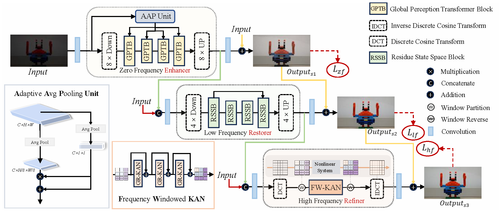

# From Zero to Detail: Deconstructing Ultra-High-Definition Image Restoration from Progressive Spectral Perspective (CVPR'2025)

[**Zhao Chen**](https://scholar.google.com/citations?hl=zh-CN&user=Uhp3JKgAAAAJ)<sup>1*</sup> · [**Zhizhou Chen**](#)<sup>1*</sup> · [**Yunzhe Xv**](#)<sup>1</sup>  · [**Enxuan GU**](#)<sup>2</sup> · [**Jian Li**](#)<sup>3</sup> · [**Zili Yi**](https://zili-yi.github.io/)<sup>1</sup> · [**Qian Wang**](#)<sup>4</sup> · [**Jian Yang**](https://scholar.google.com/citations?user=6CIDtZQAAAAJ&hl=zh-CN&oi=ao)<sup>1</sup> ·[**Ying Tai**](https://tyshiwo.github.io/)<sup>1✉</sup>

<sup>1</sup>Nanjing University · <sup>2</sup>Dalian University of Technology · <sup>3</sup>Tencent Youtu · <sup>4</sup>China Mobile

[](https://openaccess.thecvf.com/content/CVPR2024/papers/Zhao_Wavelet-based_Fourier_Information_Interaction_with_Frequency_Diffusion_Adjustment_for_Underwater_CVPR_2024_paper.pdf)

### We are the first to propose a <span style="color:red;">Hybrid Architecture</span> for low level vison, ERR, which integrates state-of-the-art operators, including <span style="color:blue;">Transformers</span>, <span style="color:green;">Mamba</span>, and <span style="color:purple;">KAN</span>.


<table class="center">
  <tr>
    <td width=100% style="border: none"></td>
  </tr>
</table>

<hr />

> **Abstract:** *Ultra-high-definition (UHD) image restoration faces significant challenges due to its high resolution, complex content, and intricate details. To cope with these challenges, we analyze the restoration process in depth through a progressive spectral perspective, and deconstruct the complex UHD restoration problem into three progressive stages: zero-frequency enhancement, low-frequency restoration, and high-frequency refinement. Building on this insight, we propose a novel framework, ERR, which comprises three collaborative sub-networks: the zero-frequency enhancer (ZFE), the low-frequency restorer (LFR), and the high-frequency refiner (HFR). Specifically, the ZFE integrates global priors to learn global mapping, while the LFR restores low-frequency information, emphasizing reconstruction of coarse-grained content. Finally, the HFR employs our designed frequency-windowed Kolmogorov-Arnold Networks (FW-KAN) to refine textures and details, producing high-quality image restoration. Our approach significantly outperforms previous UHD methods across various tasks, with extensive ablation studies validating the effectiveness of each component.* 
<hr />

## 🔥🔥🔥 News ##
- **2025.3.21**: 🍎 Our code, pretrained weights and visualization results are released!
- **2025.2.27**: 🎯 Our paper is accepted by CVPR 2025!

## 📜 Dependencies and Installation
- CUDA >= 11.8
- Pytorch >= 2.1.1
- torchvision >= 0.16.1
- kat_rational needs to be installed from https://github.com/Adamdad/rational_kat_cu
```
# create conda env
conda create -n ERR python=3.10 -y
conda activate ERR

# install python dependency
pip install -r requirement.txt
```


## 🔗 Datasets
We provide the divided dataset for UIEB and LSUI.
   
| UHD-LL | [UHD-LL](  https://drive.google.com/drive/folders/1IneTwBsSiSSVXGoXQ9_hE1cO2d4Fd4DN  ) | 

| UHD-Haze | [UHD-Haze](   https://drive.google.com/drive/folders/1PVCPkhqU_voPVFZj3FzAtUkJnQnF9lSa  ) | 

| UHD-Blur | [UHD-Blur ](   https://drive.google.com/drive/folders/1O6JYkOELLhpEkirAnxUB2JGWMqgwVvmX ) | 

| 4K-Rain13k | [4K-Rain13k](   https://pan.baidu.com/share/init?surl=Kao-OjWNlgg2Jl0Jtl7e5Q&pwd=spfi  ) | 

## 🔗 Pretrained Models
We provide  pretrained models for UHD-LL, UHD-Haze, UHD-Blur and 4K-Rain13k. You can download from [ERR_huggingface](https://huggingface.co/datasets/Chenzzzzzz/ERR).

## 🔗 Visual Results
We provide compared and ablation  visual results. You can download from [ERR_huggingface](https://huggingface.co/datasets/Chenzzzzzz/ERR).

## 🔑 Training

After preparing the training data, use 
```
bash train.sh
```

## 🔑 Testing

After preparing the testing data, use 
```
bash test.sh
```


## 📖Citation
If you use our work, please consider citing:

  
 
    @inproceedings{zhao2025ERR,
    title={From Zero to Detail: Deconstructing Ultra-High-Definition Image Restoration from Progressive Spectral Perspective},
    author={Chen Zhao and Zhizhou Chen and Yunzhe Xu and Enxuan Gu and Jian Li and Zili Yi and Qian Wang and Jian Yang and Ying Tai},
    booktitle={Proceedings of the IEEE/CVF Conference on Computer Vision and Pattern Recognition},
    year={2025}
    }

## Contact
Should you have any questions, please contact 2518628273@qq.com
 

